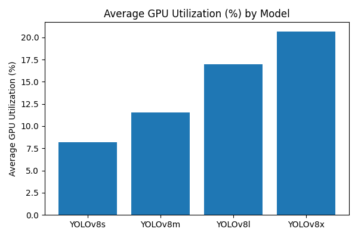
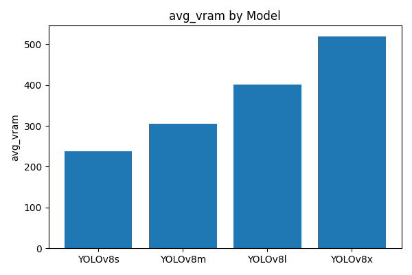
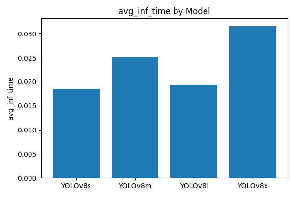
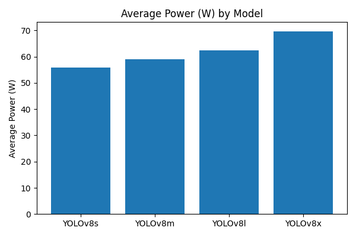

# Fall Detection System with YOLOv8 and State Machine

This repository implements a real-time fall detection system using the YOLOv8 object detection model and a state machine-based temporal logic. The application processes either local video files or RTSP streams, detects humans using YOLO, and determines fall events based on changes in bounding box orientation and time-based thresholds.

For any queries or contributions, feel free to reach out or open an issue.

## 📦 Features

- 🔍 Real-time human detection using YOLOv8 (Ultralytics)
- 🎯 Fall detection logic based on bounding box geometry and state transitions
- 🧠 State machine for robust event tracking: `start → watchdog → generateEventCheck`
- 📸 Video feed recording at full FPS and controlled FPS
- 📝 Annotated video output with timestamps and bounding box metadata
- 📁 Support for both local video files and RTSP streams

---

## 📁 Project Structure

```text
├── main.py                   # Entry point: captures video, handles state machine logic
├── config.json              # Configuration for video source, model, and parameters
├── perception_engine.py     # YOLOv8 inference engine and bounding box drawing
├── analysis_engine.py       # (Optional expansion) Analysis logic or helper states
├── helpers.py               # Utility functions for video metadata and state analysis
├── requirements.txt         # Python dependencies
├── livefeed/                # Output folder for generated videos and metadata
````

---

## ⚙️ Installation

### 1. Clone the repository

```bash
git clone https://github.com/yourusername/fall-detection-yolov8.git
cd fall-detection-yolov8
```

### 2. Create a virtual environment

```bash
python -m venv venv
source venv/bin/activate  # On Windows use `venv\Scripts\activate`
```

### 3. Install dependencies

```bash
pip install -r requirements.txt
```

---

## 🧪 Configuration

Edit the `config.json` file to set:

```json
{
  "video": {
    "url": "D:/fall_detection_v2/fall.mp4",   // or RTSP stream
    "type": "local",                          // "local" or "rtsp"
    "fps": 24,
    "display": {
      "flag": true,
      "width": 640,
      "height": 360
    }
  },
  "perception_engine": {
    "model_name": "yolov8x.pt",
    "confidence_threshold": 0.75
  },
  "analysis_engine": {
    "state_tolerance_sec": 2,
    "fps": 2
  }
}
```

---

## 🚀 Usage

### Run the system:

```bash
python main.py
```

Press `q` at any time to quit the stream.

---

## 📂 Outputs

After execution, you’ll find the following outputs in the `livefeed/` directory:

* **`*_live_full_fps.mp4`** — Raw recording at source FPS
* **`*_live_feed_controlled_fps.mp4`** — Downsampled video for analysis
* **`*_annotated_controlled_fps.mp4`** — Bounding boxes and state annotations
* **`*_meta_data.json`** — Bounding box metadata
* **`*_events.json`** — All detected fall events with timestamps

---

## 🧠 How It Works

1. **YOLOv8** detects people in each frame.
2. Bounding box width and height ratios are monitored.
3. A state machine transitions through:

   * `start` → waiting for bounding box flip (width > height to height > width)
   * `watchdog` → monitoring for duration (`state_tolerance_sec`)
   * `generateEventCheck` → confirming and logging fall events
4. Events are saved and annotated on the video.

---

## 🛠️ Requirements

* Python 3.11
* NVIDIA GPU (recommended for YOLO inference)
* `yolov8x.pt` model from [Ultralytics](https://github.com/ultralytics/ultralytics)

---

## 📌 TODO / Improvements

* Expand `analysis_engine.py` for modular event logic
* Add alert system (email, SMS)
* Add pose estimation or optical flow module
* Multi-person fall differentiation
* GUI for easier interaction

---

## 📄 License

This project is released under the MIT License.

---

## 📈 Results: YOLOv8s vs YOLOv8m vs YOLOv8l vs YOLOv8x

This section summarizes the GPU benchmarking results obtained from processing all CCTV clips across four YOLOv8 model sizes.

### **1. Average Inference Time (seconds per frame)**  
| Model      | Time (s) | Approx FPS |
|------------|----------|------------|
| YOLOv8s    | 0.018 s  | ~55 FPS    |
| YOLOv8m    | 0.025 s  | ~40 FPS    |
| YOLOv8l    | 0.019 s  | ~52 FPS    |
| YOLOv8x    | 0.032 s  | ~31 FPS    |

### **2. Average VRAM Usage (MB)**  
| Model      | Avg VRAM |
|------------|-----------|
| YOLOv8s    | ~230 MB   |
| YOLOv8m    | ~305 MB   |
| YOLOv8l    | ~400 MB   |
| YOLOv8x    | ~525 MB   |

### **3. Peak VRAM Usage (MB)**  
| Model      | Peak VRAM |
|------------|-----------|
| YOLOv8s    | ~370 MB   |
| YOLOv8m    | ~460 MB   |
| YOLOv8l    | ~570 MB   |
| YOLOv8x    | ~670 MB   |

### **4. Average GPU Utilization (%)**
| Model      | Utilization |
|------------|-------------|
| YOLOv8s    | ~8.5%       |
| YOLOv8m    | ~11.5%      |
| YOLOv8l    | ~17%        |
| YOLOv8x    | ~21%        |

### **5. Average Power Consumption (W)**
| Model      | Power (W) |
|------------|-----------|
| YOLOv8s    | ~56 W     |
| YOLOv8m    | ~59 W     |
| YOLOv8l    | ~62 W     |
| YOLOv8x    | ~70 W     |

---

## 📊 Visual Summary

### **Average GPU Utilization**


### **Average VRAM Usage**


### **Peak VRAM Usage**


### **Average Inference Time**


### **Average Power**


---

## 🧠 Interpretation & Takeaways

- **YOLOv8s** is the most efficient model:
  - Fastest inference (~55 FPS)
  - Lowest GPU utilization
  - Lowest VRAM usage
  - Best choice for real-time fall detection on low or mid-range GPUs.

- **YOLOv8m** provides a balanced improvement in robustness while maintaining good speed (~40 FPS).

- **YOLOv8l** behaves unexpectedly fast in some clips due to batch-size and optimization effects and maintains moderate VRAM usage.

- **YOLOv8x** is the heaviest:
  - Highest VRAM consumption (~525–670 MB)
  - Highest power draw (~70 W)
  - Slowest (≈ 31 FPS)
  - Only recommended if maximum accuracy is required.

Overall, **YOLOv8s** is the optimal choice for real-time CCTV fall detection.


---

## 👨‍💻 Author

Muhammad Ammar Anees, Asad Soomro

